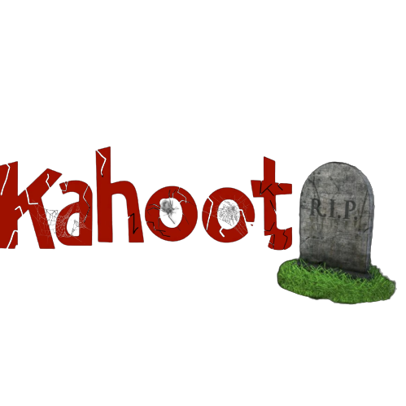

#RIPKAHOOT

<h1 align="center">RIP KAHOOT</h1>

<p align="center">

</p>
### AHORA CON LA VERSIÓN MEJORADA TE MUESTRA QUE COLOR CORRESPONDE A CADA RESPUESTA!

### [*] ENCUENTRA LAS RESPUESTAS DE KAHOOTS DE MANERA AUTOMATICA!

Este script de Python está diseñado para encontrar las respuestas correctas en quizzes públicos de Kahoot y mostrarlas con códigos de colores. Utiliza la API de Kahoot para obtener información del quiz y luego extrae las respuestas correctas de la respuesta JSON.

### Requisitos Previos:

Antes de utilizar este script, asegúrate de contar con los siguientes requisitos previos:

Python: Asegúrate de tener Python 3 instalado en tu sistema.

Biblioteca colorama: Instala la biblioteca colorama, que proporciona colores de texto en la terminal. Puedes instalarla utilizando pip:

```pip install colorama```

### [+] INSTALACIÓN
======
Clona el repositorio o descarga el script en tu máquina local: 

```git clone https://github.com/AAO0OSS/RIPKAHOOT.git```

Abre una terminal o símbolo del sistema y navega al directorio donde se encuentra el script:

```cd RIPKAHOOT```

Ejecuta el script con el siguiente comando:

```python3 RIPkahoot.py```

El script mostrará un banner y te pedirá que ingreses la ID del quiz de Kahoot.

Ingresa la ID del quiz (el quiz debe ser público) o escribe 'exit' para salir del script.

El script recuperará los datos del quiz, identificará las respuestas correctas en orden.

### [√] ¿Por Qué Utilizar Este Script?

======

Este script puede ser útil cuando desees encontrar rápidamente las respuestas correctas en un quiz de Kahoot. Puede ahorrarte tiempo y esfuerzo al participar o dirigir un juego de Kahoot. Sin embargo, es importante utilizar este script de manera responsable y solo en quizzes de Kahoot públicos. El uso indebido de este script en quizzes no autorizados no es ético.

## [!] Atención
======

***Este script se proporciona con fines educativos y su uso debe cumplir con los términos de servicio de Kahoot y las leyes y regulaciones aplicables. Sé respetuoso y úsalo de manera responsable.***

***Aviso Legal: Este script no está afiliado de ninguna manera con Kahoot y es un proyecto independiente con fines educativos.***

